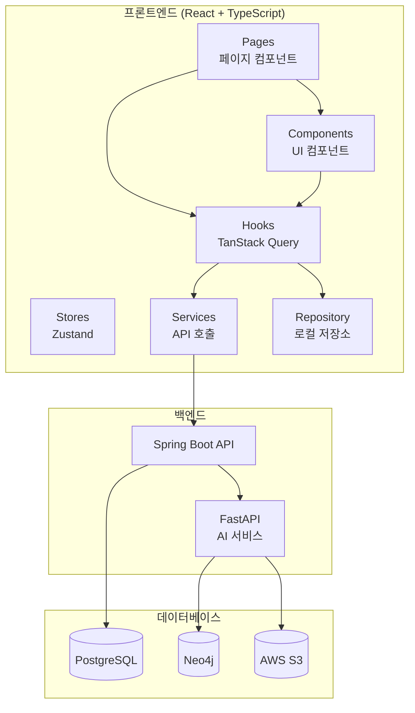
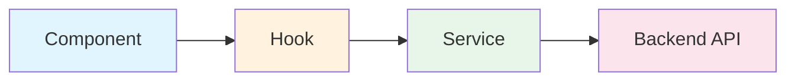
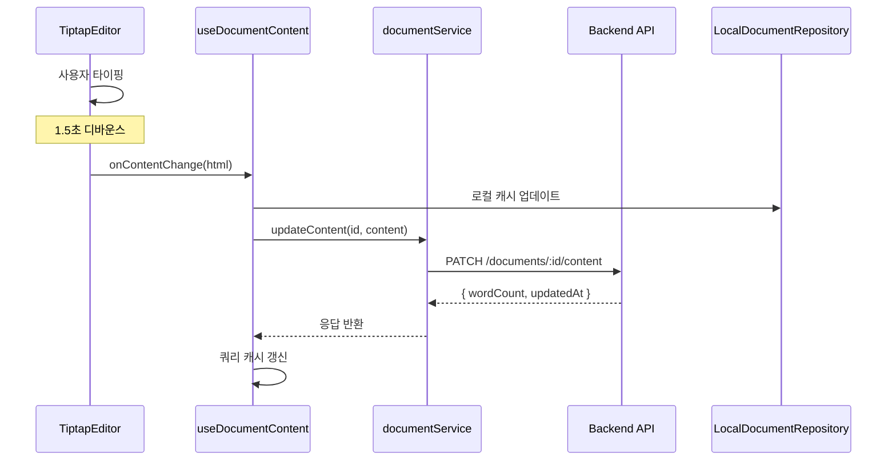
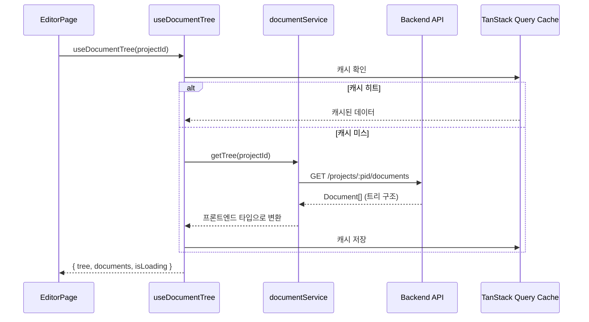
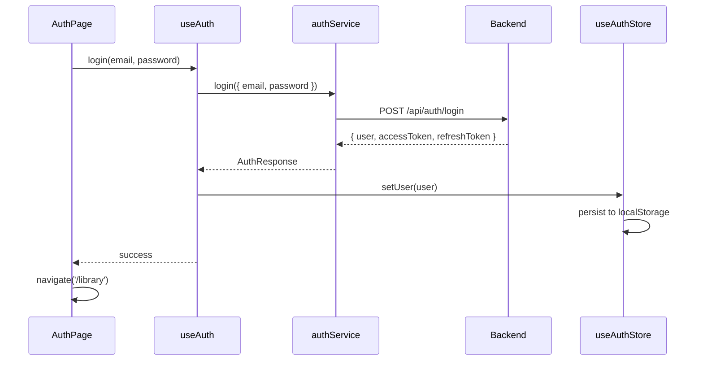
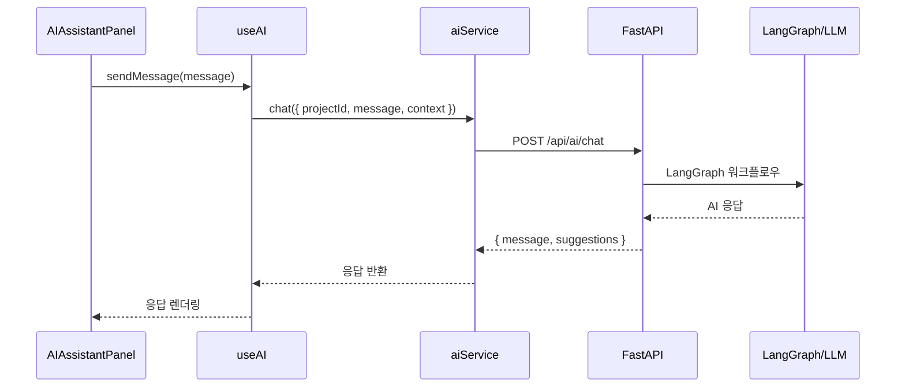
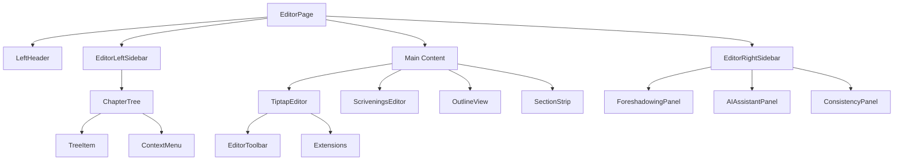

# StoLink 프론트엔드 코드베이스 가이드

> **목적**: 팀원들이 프로젝트 구조와 데이터 흐름을 빠르게 이해할 수 있도록 정리한 문서
> **작성일**: 2025년 12월 26일

---

## 📐 전체 아키텍처 개요



---

## 🗂️ 디렉토리 구조와 역할

```
src/
├── api/                  # Axios 클라이언트 (1개 파일)
├── components/           # UI 컴포넌트 (60개+)
│   ├── editor/          # 에디터 관련 컴포넌트
│   ├── graph/           # 관계도 (React Flow)
│   └── ui/              # shadcn/ui 기본 컴포넌트
├── hooks/               # TanStack Query 훅 (12개) ⭐
├── pages/               # 페이지 컴포넌트 (9개)
├── repositories/        # 로컬 저장소 인터페이스
├── services/            # API 서비스 레이어 (12개) ⭐
├── stores/              # Zustand 상태관리 (8개)
└── types/               # TypeScript 타입 정의 (9개)
```

---

## 🔄 데이터 흐름 패턴

### 핵심 원칙: 3-Layer 아키텍처



| 레이어        | 역할                                    | 파일 위치               |
| ------------- | --------------------------------------- | ----------------------- |
| **Component** | UI 렌더링, 사용자 입력 처리             | `components/`, `pages/` |
| **Hook**      | 서버 상태 관리, 캐싱, Optimistic Update | `hooks/`                |
| **Service**   | HTTP 요청, 응답 변환                    | `services/`             |

---

## 📊 주요 기능별 데이터 흐름

### 1. 문서 저장 흐름 (Document Save)

> **관련 파일**: `TiptapEditor.tsx` → `useDocuments.ts` → `documentService.ts`



**수정할 때 건드려야 할 파일:**

- 저장 로직 변경 → [useDocuments.ts](file:///Users/dongha/jungle/sto-link/src/hooks/useDocuments.ts) (`useDocumentContent` 훅)
- 디바운스 시간 변경 → [TiptapEditor.tsx](file:///Users/dongha/jungle/sto-link/src/components/editor/TiptapEditor.tsx)
- API 엔드포인트 변경 → [documentService.ts](file:///Users/dongha/jungle/sto-link/src/services/documentService.ts)

---

### 2. 문서 트리 조회 흐름 (Document Tree Fetch)

> **관련 파일**: `EditorPage.tsx` → `useDocuments.ts` → `documentService.ts`



**수정할 때 건드려야 할 파일:**

- 트리 데이터 가공 → [useDocuments.ts](file:///Users/dongha/jungle/sto-link/src/hooks/useDocuments.ts) (`useDocumentTree`)
- 백엔드→프론트엔드 타입 변환 → [documentService.ts](file:///Users/dongha/jungle/sto-link/src/services/documentService.ts) (`mapBackendToFrontend`)

---

### 3. 인증 흐름 (Authentication)

> **관련 파일**: `AuthPage.tsx` → `useAuth.ts` → `authService.ts` → `useAuthStore.ts`



**수정할 때 건드려야 할 파일:**

- 로그인 UI → [AuthPage.tsx](file:///Users/dongha/jungle/sto-link/src/pages/auth/AuthPage.tsx)
- 인증 로직 → [useAuth.ts](file:///Users/dongha/jungle/sto-link/src/hooks/useAuth.ts)
- 토큰 관리 → [useAuthStore.ts](file:///Users/dongha/jungle/sto-link/src/stores/useAuthStore.ts)
- API 요청 인터셉터 → [client.ts](file:///Users/dongha/jungle/sto-link/src/api/client.ts)

---

### 4. AI 챗봇 흐름

> **관련 파일**: `AIAssistantPanel.tsx` → `useAI.ts` → `aiService.ts`



---

## 🏪 상태 관리 전략

### Zustand vs TanStack Query 사용 구분

| 상태 유형                  | 도구            | 예시                            |
| -------------------------- | --------------- | ------------------------------- |
| **서버 상태** (API 데이터) | TanStack Query  | 문서, 프로젝트, 캐릭터 목록     |
| **전역 UI 상태**           | Zustand         | 사이드바 열림/닫힘, 포커스 모드 |
| **에디터 로컬 상태**       | Tiptap 내장     | 에디터 커서, 선택 영역          |
| **폼 상태**                | React Hook Form | 로그인 폼, 작품 생성 모달       |

### Zustand 스토어 (8개)

| 스토어                                                                                            | 역할   | 주요 상태                                   |
| ------------------------------------------------------------------------------------------------- | ------ | ------------------------------------------- |
| [useAuthStore](file:///Users/dongha/jungle/sto-link/src/stores/useAuthStore.ts)                   | 인증   | `user`, `isAuthenticated`                   |
| [useEditorStore](file:///Users/dongha/jungle/sto-link/src/stores/useEditorStore.ts)               | 에디터 | `currentProjectId`, `viewMode`, `splitView` |
| [useUIStore](file:///Users/dongha/jungle/sto-link/src/stores/useUIStore.ts)                       | UI     | `sidebarOpen`, `theme`                      |
| [useSceneStore](file:///Users/dongha/jungle/sto-link/src/stores/useSceneStore.ts)                 | Scene  | Scene CRUD                                  |
| [useDemoStore](file:///Users/dongha/jungle/sto-link/src/stores/useDemoStore.ts)                   | 데모   | 데모 모드 데이터                            |
| [useForeshadowingStore](file:///Users/dongha/jungle/sto-link/src/stores/useForeshadowingStore.ts) | 복선   | 복선 목록, 등장 위치                        |
| [useChapterStore](file:///Users/dongha/jungle/sto-link/src/stores/useChapterStore.ts)             | 챕터   | 챕터 트리                                   |

### TanStack Query 훅 (12개)

| 훅                                                                                     | Query Key                      | 용도             |
| -------------------------------------------------------------------------------------- | ------------------------------ | ---------------- |
| [useDocuments](file:///Users/dongha/jungle/sto-link/src/hooks/useDocuments.ts)         | `['documents', projectId]`     | 문서 트리, CRUD  |
| [useProjects](file:///Users/dongha/jungle/sto-link/src/hooks/useProjects.ts)           | `['projects', 'list']`         | 프로젝트 목록    |
| [useCharacters](file:///Users/dongha/jungle/sto-link/src/hooks/useCharacters.ts)       | `['characters', projectId]`    | 캐릭터 관리      |
| [useRelationships](file:///Users/dongha/jungle/sto-link/src/hooks/useRelationships.ts) | `['relationships', projectId]` | 관계 관리        |
| [useForeshadowing](file:///Users/dongha/jungle/sto-link/src/hooks/useForeshadowing.ts) | `['foreshadowing', projectId]` | 복선 관리        |
| [usePlaces](file:///Users/dongha/jungle/sto-link/src/hooks/usePlaces.ts)               | `['places', projectId]`        | 장소 관리        |
| [useItems](file:///Users/dongha/jungle/sto-link/src/hooks/useItems.ts)                 | `['items', projectId]`         | 아이템 관리      |
| [useAuth](file:///Users/dongha/jungle/sto-link/src/hooks/useAuth.ts)                   | -                              | 인증             |
| [useAI](file:///Users/dongha/jungle/sto-link/src/hooks/useAI.ts)                       | -                              | AI 기능          |
| [useExport](file:///Users/dongha/jungle/sto-link/src/hooks/useExport.ts)               | -                              | 내보내기         |
| [useShare](file:///Users/dongha/jungle/sto-link/src/hooks/useShare.ts)                 | -                              | 공유             |
| [useJobPolling](file:///Users/dongha/jungle/sto-link/src/hooks/useJobPolling.ts)       | `['job', jobId]`               | 비동기 작업 폴링 |

---

## 🛠️ 기능별 수정 가이드

### "문서 저장 방식을 변경하고 싶어요"

1. **디바운스 시간 변경**: [TiptapEditor.tsx](file:///Users/dongha/jungle/sto-link/src/components/editor/TiptapEditor.tsx)
2. **저장 로직 변경**: [useDocuments.ts](file:///Users/dongha/jungle/sto-link/src/hooks/useDocuments.ts)의 `useDocumentContent`
3. **API 엔드포인트 변경**: [documentService.ts](file:///Users/dongha/jungle/sto-link/src/services/documentService.ts)의 `updateContent`

---

### "새로운 API를 추가하고 싶어요"

1. **타입 정의**: `src/types/` 에 새 인터페이스 추가
2. **서비스 추가**: `src/services/` 에 새 서비스 파일 생성
3. **훅 추가**: `src/hooks/` 에 TanStack Query 훅 생성
4. **컴포넌트에서 사용**: 훅을 import해서 사용

```typescript
// 1. types/newFeature.ts
export interface NewFeature {
  id: string;
  name: string;
}

// 2. services/newFeatureService.ts
export const newFeatureService = {
  getAll: async () => api.get("/new-feature"),
  create: async (data) => api.post("/new-feature", data),
};

// 3. hooks/useNewFeature.ts
export function useNewFeature() {
  return useQuery({
    queryKey: ["new-feature"],
    queryFn: newFeatureService.getAll,
  });
}
```

---

### "에디터 기능을 추가하고 싶어요"

1. **Tiptap Extension**: [src/components/editor/extensions/](file:///Users/dongha/jungle/sto-link/src/components/editor/extensions)에 새 익스텐션 추가
2. **TiptapEditor에 등록**: [TiptapEditor.tsx](file:///Users/dongha/jungle/sto-link/src/components/editor/TiptapEditor.tsx)의 extensions 배열에 추가
3. **툴바 버튼 추가** (필요시): [EditorToolbar.tsx](file:///Users/dongha/jungle/sto-link/src/components/editor/EditorToolbar.tsx)

---

### "새로운 페이지를 추가하고 싶어요"

1. **페이지 컴포넌트**: `src/pages/` 에 새 페이지 생성
2. **라우팅 추가**: [App.tsx](file:///Users/dongha/jungle/sto-link/src/App.tsx)에 Route 추가
3. **레이아웃 선택**: `ProtectedLayout` (인증 필요) 또는 공개 페이지

---

## 📡 API 레이어 상세

### Axios 클라이언트 ([client.ts](file:///Users/dongha/jungle/sto-link/src/api/client.ts))

```typescript
// 인터셉터 구조
Request Interceptor → X-User-Id 헤더 추가
Response Interceptor → 401 에러 시 자동 로그아웃
```

### 서비스 레이어 패턴

```typescript
// services/documentService.ts 예시
export const documentService = {
  // GET 요청
  getTree: async (projectId: string) => {
    const response = await api.get(`/projects/${projectId}/documents`);
    return response.data;
  },

  // PATCH 요청
  updateContent: async (id: string, content: string) => {
    const response = await api.patch(`/documents/${id}/content`, { content });
    return response.data;
  },
};
```

---

## 🎯 핵심 컴포넌트 관계

### EditorPage 컴포넌트 트리



---

## 📚 관련 문서 참조

| 문서                                                                    | 내용                |
| ----------------------------------------------------------------------- | ------------------- |
| [SPEC.md](file:///Users/dongha/jungle/sto-link/SPEC.md)                 | 전체 기능 명세      |
| [API_SPEC.md](file:///Users/dongha/jungle/sto-link/API_SPEC.md)         | API 엔드포인트 상세 |
| [ARCHITECTURE.md](file:///Users/dongha/jungle/sto-link/ARCHITECTURE.md) | 프로젝트 아키텍처   |
| [DATA_MODEL.md](file:///Users/dongha/jungle/sto-link/DATA_MODEL.md)     | 데이터 모델 정의    |
| [TECHSTACK.md](file:///Users/dongha/jungle/sto-link/TECHSTACK.md)       | 기술 스택 상세      |

---

## 💡 자주 묻는 질문

### Q: 데모 모드와 실제 모드의 차이는?

- **데모 모드**: `LocalDocumentRepository` (Zustand + localStorage)
- **실제 모드**: `documentService` → Backend API

### Q: 왜 Repository 패턴을 사용하나요?

- 데모/실제 모드 전환이 쉬움
- 테스트 용이
- 오프라인 지원 가능

### Q: TanStack Query의 캐시 무효화는 어떻게 하나요?

```typescript
// hooks/useDocuments.ts 참조
queryClient.invalidateQueries({ queryKey: ["documents", projectId] });
```
