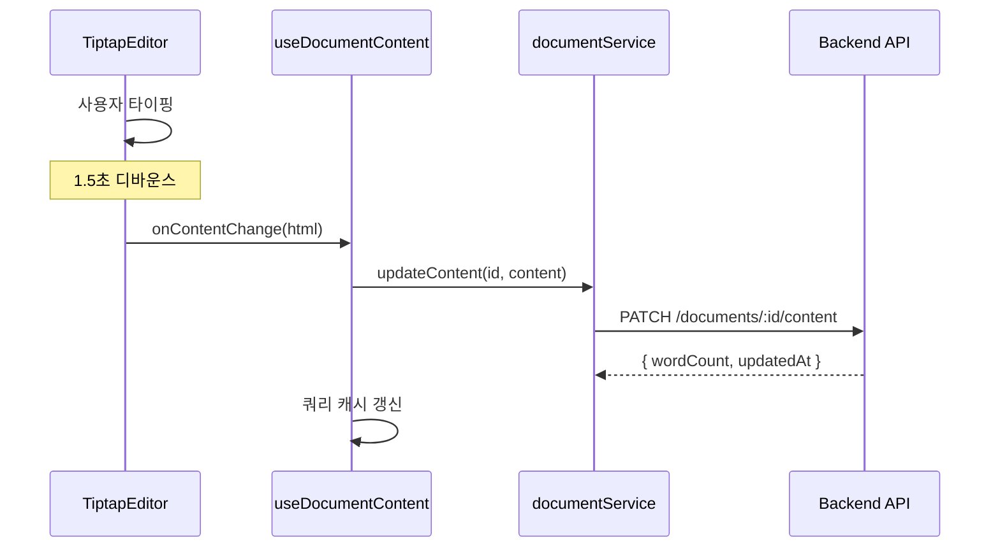
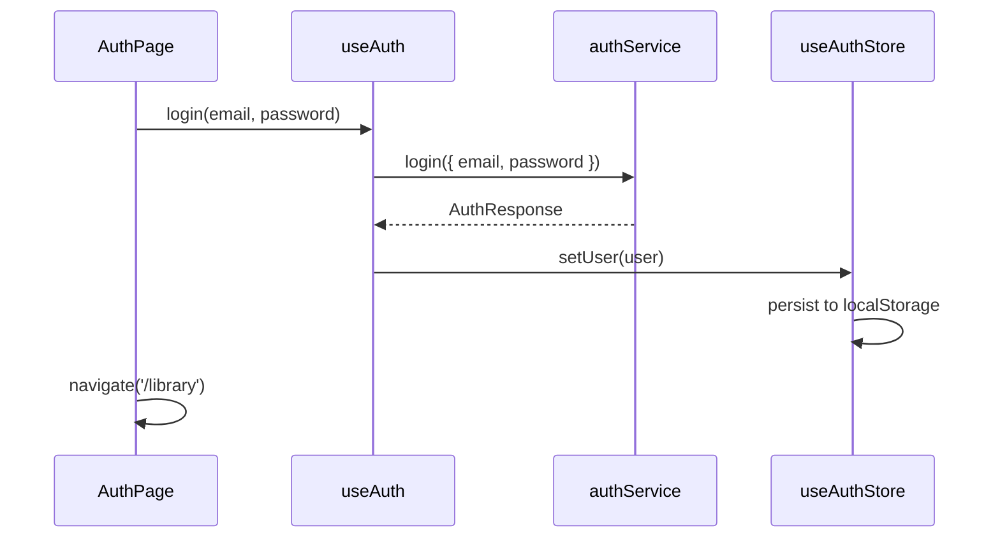

# StoLink 프로젝트 아키텍처

> **최종 수정**: 2025년 12월 28일
> **기술 스택**: React 19.2 + TypeScript 5.9 + Vite 7.2 + Zustand 5.0 + TanStack Query 5.90 + D3.js 7.x

---

## 개요

**StoLink**는 작가용 AI 기반 스토리 관리 플랫폼입니다.

- 복선 관리, 캐릭터 관계도, 세계관 설정, 일관성 체크
- 대상: 장편 소설 작가 (방대한 세계관 관리 필요)

> 📖 상세 기술 스택 → [TECHSTACK.md](./TECHSTACK.md)
> 📋 기능 명세 → [SPEC.md](../spec/SPEC.md)
> 🗂️ 데이터 모델 → [DATA_MODEL.md](../spec/DATA_MODEL.md)
> 📡 API 명세 → [API_SPEC.md](../spec/API_SPEC.md)

---

## 디렉토리 구조

```
src/
├── App.tsx               # 라우팅 설정
├── main.tsx              # 엔트리포인트
├── index.css             # 전역 스타일
│
├── api/                  # API 클라이언트 (1개)
│   └── client.ts         # Axios 인스턴스, 인터셉터
│
├── assets/               # 정적 리소스
│
├── components/           # 컴포넌트 (60개)
│   ├── common/           # 공통 (4개: Footer, Modal 등)
│   ├── editor/           # 에디터 관련 (27개)
│   │   ├── extensions/   # Tiptap 커스텀 익스텐션
│   │   │   ├── CharacterMention.ts
│   │   │   ├── CharacterNodeView.tsx
│   │   │   ├── CommandList.tsx
│   │   │   └── ...
│   │   ├── sidebar/      # 사이드바 컴포넌트
│   │   │   ├── ChapterTree.tsx
│   │   │   ├── TreeItem.tsx
│   │   │   └── ContextMenu.tsx
│   │   ├── TiptapEditor.tsx
│   │   ├── SectionStrip.tsx
│   │   ├── ScriveningsEditor.tsx
│   │   ├── OutlineView.tsx
│   │   ├── ForeshadowingPanel.tsx
│   │   ├── AIAssistantPanel.tsx
│   │   ├── ConsistencyPanel.tsx
│   │   └── ...
│   ├── CharacterGraph/   # 관계도 (D3.js Force Simulation)
│   ├── layouts/          # 레이아웃 (3개)
│   ├── library/          # 서재 관련 (3개)
│   │   ├── BookCard.tsx
│   │   ├── CreateBookCard.tsx
│   │   └── ImportBookCard.tsx
│   └── ui/               # shadcn/ui (23개)
│
├── data/                 # 목 데이터, 상수 (3개)
│   └── demoData.ts       # 데모 모드 목 데이터
│
├── hooks/                # 커스텀 훅 (19개) ⭐
│   ├── useDocuments.ts   # 문서 CRUD (TanStack Query)
│   ├── useProjects.ts    # 프로젝트 관리
│   ├── useCharacters.ts  # 캐릭터 관리
│   ├── useForeshadowing.ts # 복선 관리
│   ├── useRelationships.ts # 관계 관리
│   ├── useRelationshipLinks.ts # 관계 링크 변환
│   ├── usePlaces.ts      # 장소 관리
│   ├── useItems.ts       # 아이템 관리
│   ├── useAuth.ts        # 인증
│   ├── useAI.ts          # AI 기능
│   ├── useExport.ts      # 내보내기
│   ├── useShare.ts       # 공유
│   ├── useJobPolling.ts  # 비동기 작업 폴링
│   ├── useCharacterGraphSimulation.ts # D3 Force 시뮬레이션
│   ├── useCharacterGraphDrag.ts   # 그래프 드래그
│   ├── useCharacterGraphZoom.ts   # 그래프 줌/팬
│   ├── useCharacterGraphResize.ts # 그래프 리사이즈
│   ├── useNetworkSimulation.ts    # 네트워크 시뮬레이션
│   └── useUpdateProjectStatus.ts  # 프로젝트 상태 업데이트
│
├── lib/                  # 유틸리티 (1개)
│   └── utils.ts          # cn 함수 등
│
├── pages/                # 페이지 컴포넌트 (9개)
│   ├── auth/AuthPage.tsx
│   ├── editor/EditorPage.tsx
│   ├── landing/LandingPage.tsx
│   ├── library/LibraryPage.tsx
│   └── ...
│
├── repositories/         # 로컬 데이터 저장소 (2개)
│   ├── DocumentRepository.ts
│   └── LocalDocumentRepository.ts
│
├── services/             # API 서비스 레이어 (12개) ⭐
│   ├── documentService.ts
│   ├── projectService.ts
│   ├── characterService.ts
│   ├── relationshipService.ts
│   ├── foreshadowingService.ts
│   ├── placeService.ts
│   ├── itemService.ts
│   ├── authService.ts
│   ├── aiService.ts
│   ├── exportService.ts
│   ├── shareService.ts
│   └── index.ts
│
├── stores/               # Zustand 스토어 (8개)
│   ├── useAuthStore.ts
│   ├── useEditorStore.ts
│   ├── useUIStore.ts
│   ├── useForeshadowingStore.ts
│   ├── useChapterStore.ts
│   ├── useSceneStore.ts
│   ├── useDemoStore.ts
│   └── index.ts
│
├── styles/               # 추가 스타일
│
└── types/                # TypeScript 타입 (11개)
    ├── document.ts       # Document, DocumentMetadata
    ├── project.ts        # Project, ProjectStats
    ├── character.ts      # Character, Place, Item, BackendRelationship
    ├── characterGraph.ts # CharacterNode, RelationshipLink (D3.js)
    ├── foreshadowing.ts
    ├── auth.ts
    ├── api.ts            # ApiResponse, JobResponse
    ├── chapter.ts
    ├── scene.ts
    ├── network.ts        # 네트워크 관련 타입
    └── index.ts
```

---

## 라우팅 구조

```
/ ─────────────── LandingPage (공개)
/auth ─────────── AuthPage (공개)
/demo ─────────── EditorPage (데모, 인증 불필요)

/library ──────── LibraryPage ─── ProtectedLayout
/projects/:id ─── ProjectLayout
    ├── /editor ── EditorPage
    ├── /studio ── StudioPage
    ├── /world ─── WorldPage
    ├── /stats ─── StatsPage
    ├── /export ── ExportPage
    └── /settings ─ SettingsPage
```

---

## 상태 관리

### 전략: 하이브리드 (Zustand + TanStack Query)

```
┌─────────────────────────────────────────────────────────┐
│                     상태 유형별 도구                      │
├─────────────────────────────────────────────────────────┤
│  서버 상태 (API 데이터)     →  TanStack Query           │
│  전역 UI 상태 (사이드바 등)  →  Zustand                  │
│  폼 상태 (입력값, 검증)     →  React Hook Form + Zod    │
│  로컬 컴포넌트 상태         →  useState                  │
│  에디터 상태 (문서 내용)    →  Tiptap 내장 상태          │
└─────────────────────────────────────────────────────────┘
```

### Zustand 스토어 (8개)

| 스토어                  | 역할                         | 미들웨어  |
| ----------------------- | ---------------------------- | --------- |
| `useAuthStore`          | 인증 상태, 토큰 관리         | `persist` |
| `useEditorStore`        | 프로젝트/챕터, 분할화면, 줌  | -         |
| `useUIStore`            | 사이드바, 모달, 테마         | -         |
| `useSceneStore`         | Scene CRUD, 캐릭터/복선 연결 | `immer`   |
| `useDemoStore`          | 데모 모드 데이터             | -         |
| `useForeshadowingStore` | 복선 CRUD, 등장 위치         | -         |
| `useChapterStore`       | 챕터 CRUD                    | -         |

### TanStack Query 훅 (12개) + D3 그래프 훅 (5개) + 기타 훅 (2개)

| 훅                 | 역할                | Query Key 패턴                 |
| ------------------ | ------------------- | ------------------------------ |
| `useDocuments`     | 문서 트리, CRUD     | `['documents', projectId]`     |
| `useProjects`      | 프로젝트 목록, CRUD | `['projects', 'list', params]` |
| `useCharacters`    | 캐릭터 관리         | `['characters', projectId]`    |
| `useRelationships` | 관계 관리           | `['relationships', projectId]` |
| `useForeshadowing` | 복선 관리           | `['foreshadowing', projectId]` |
| `usePlaces`        | 장소 관리           | `['places', projectId]`        |
| `useItems`         | 아이템 관리         | `['items', projectId]`         |
| `useAuth`          | 인증 상태           | -                              |
| `useAI`            | AI 분석             | -                              |
| `useExport`        | 내보내기            | -                              |
| `useShare`         | 공유                | -                              |
| `useJobPolling`    | 비동기 작업 폴링    | `['job', jobId]`               |

### D3 그래프 훅 (5개)

| 훅                            | 역할                     |
| ----------------------------- | ------------------------ |
| `useCharacterGraphSimulation` | D3 Force 물리 시뮬레이션 |
| `useCharacterGraphDrag`       | 노드 드래그 인터랙션     |
| `useCharacterGraphZoom`       | SVG 줌/팬 제어           |
| `useCharacterGraphResize`     | 컨테이너 리사이즈 감지   |
| `useRelationshipLinks`        | 관계→링크 데이터 변환    |

---

## 컴포넌트 구조

### Editor 컴포넌트 (27개)

| 컴포넌트             | 역할                      |
| -------------------- | ------------------------- |
| `TiptapEditor`       | 메인 에디터 (줌 50-200%)  |
| `SectionStrip`       | 하단 섹션 카드 네비게이션 |
| `ScriveningsEditor`  | 통합 편집 모드            |
| `OutlineView`        | 테이블 기반 아웃라인      |
| `EditorLeftSidebar`  | 좌측 챕터 트리 래퍼       |
| `EditorRightSidebar` | 우측 패널                 |
| `ForeshadowingPanel` | 복선 관리                 |
| `AIAssistantPanel`   | AI 어시스턴트             |
| `ConsistencyPanel`   | 일관성 체크               |
| `DemoHeader`         | 데모 모드 헤더            |

### Editor Extensions (Tiptap)

| 익스텐션             | 역할                  |
| -------------------- | --------------------- |
| `CharacterMention`   | @캐릭터 멘션 자동완성 |
| `CharacterNodeView`  | 캐릭터 노드 렌더링    |
| `CharacterHoverCard` | 캐릭터 호버 카드      |
| `CommandList`        | / 명령어 팔레트       |

### Editor Sidebar

| 컴포넌트      | 역할                             |
| ------------- | -------------------------------- |
| `ChapterTree` | 메인 트리 컨테이너               |
| `TreeItem`    | 개별 노드 (클릭/더블클릭/우클릭) |
| `ContextMenu` | 재사용 우클릭 메뉴               |
| `NodeIcon`    | 타입별 아이콘                    |

---

## 개발 워크플로우

### 스크립트

```bash
npm run dev          # 개발 서버 (localhost:5173)
npm run build        # 프로덕션 빌드 (tsc + vite build)
npm run lint         # ESLint
npm run lint:fix     # ESLint 자동 수정
npm run type-check   # TypeScript 검사
npm run format       # Prettier
```

### Git Hooks (Husky)

- `pre-commit`: lint-staged (ESLint + Prettier)
- `commit-msg`: commitlint (컨벤셔널 커밋)

### 브랜치 전략 (3-Layer)

```
main ─────── 프로덕션 (직접 push 금지)
dev ──── 개발 통합, 스테이징 (직접 push 금지)
feature/* ── 기능 개발 → dev PR
fix/* ────── 버그 수정 → dev PR
hotfix/* ─── 긴급 수정 → main PR (자동 backport to dev)
```

> 상세 가이드: [GIT_STRATEGY.md](../workflow/GIT_STRATEGY.md)

---

## CI/CD 파이프라인

| 워크플로우            | 트리거           | 동작                   |
| --------------------- | ---------------- | ---------------------- |
| `ai-review.yml`       | PR 생성/업데이트 | Claude API로 코드 리뷰 |
| `deploy.yml`          | main push        | S3 + CloudFront 배포   |
| `deploy_dev.yml`      | dev push         | 개발 환경 배포         |
| `hotfix-backport.yml` | hotfix→main 머지 | develop에 자동 체리픽  |

---

## 현재 진행 상태

### Phase 1 (완료) ✅

- [x] Scene 타입 정의
- [x] useSceneStore 생성
- [x] SceneInspector 패널
- [x] Section Strip 구현
- [x] Scrivenings 뷰

### Phase 2 (완료) ✅

- [x] 사이드바 컴포넌트 분리 (sidebar/)
- [x] Context-Sensitive Menu 구현
- [x] 에디터 줌 기능 (50-200%)
- [x] 텍스트 가져오기 (TXT/MD) + 스마트 정리
- [x] 내보내기 서비스 (PDF/EPUB/TXT/DOCX)

### Phase 3 (완료) ✅

- [x] TanStack Query 도입 (서버 상태 분리)
- [x] Service Layer 분리 (12개 서비스)
- [x] Optimistic Updates 구현
- [x] Job Polling 패턴

### Phase 4 (진행중) 🚧

- [ ] 스냅샷/버전 관리
- [ ] 통계 대시보드
- [ ] 드래그 앤 드롭 순서 변경

---

## 데이터 흐름 패턴

### 문서 저장 흐름



### 인증 흐름



---

## 기능별 수정 가이드

### "문서 저장 방식을 변경하고 싶어요"

1. **디바운스 시간 변경**: `TiptapEditor.tsx`
2. **저장 로직 변경**: `useDocuments.ts`의 `useDocumentContent`
3. **API 엔드포인트 변경**: `documentService.ts`의 `updateContent`

### "새로운 API를 추가하고 싶어요"

1. `src/types/` 에 새 인터페이스 추가
2. `src/services/` 에 새 서비스 파일 생성
3. `src/hooks/` 에 TanStack Query 훅 생성
4. 컴포넌트에서 훅을 import해서 사용

### "에디터 기능을 추가하고 싶어요"

1. `src/components/editor/extensions/`에 새 Tiptap 익스텐션 추가
2. `TiptapEditor.tsx`의 extensions 배열에 등록
3. (필요시) `EditorToolbar.tsx`에 툴바 버튼 추가

---

## FAQ

**Q: 데모 모드와 실제 모드의 차이는?**

- 데모 모드: `LocalDocumentRepository` (Zustand + localStorage)
- 실제 모드: `documentService` → Backend API

**Q: Repository 패턴을 사용하는 이유?**

- 데모/실제 모드 전환 쉬움, 테스트 용이, 오프라인 지원 가능

**Q: TanStack Query의 캐시 무효화는?**

```typescript
queryClient.invalidateQueries({ queryKey: ["documents", projectId] });
```

---

## 버전 이력

| 버전 | 날짜       | 변경 내용                                                                           |
| ---- | ---------- | ----------------------------------------------------------------------------------- |
| 1.0  | 2024.12.25 | 최초 작성                                                                           |
| 2.0  | 2025.12.26 | TanStack Query 도입, 12 hooks / 12 services 반영, 브랜치 전략 3-Layer, Phase 3 완료 |
| 2.1  | 2025.12.28 | D3.js Force Simulation 도입, 그래프 훅 5개 추가, 총 19개 훅 반영                    |
