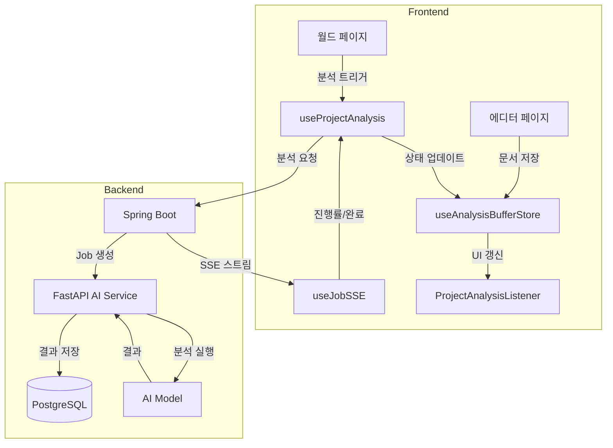
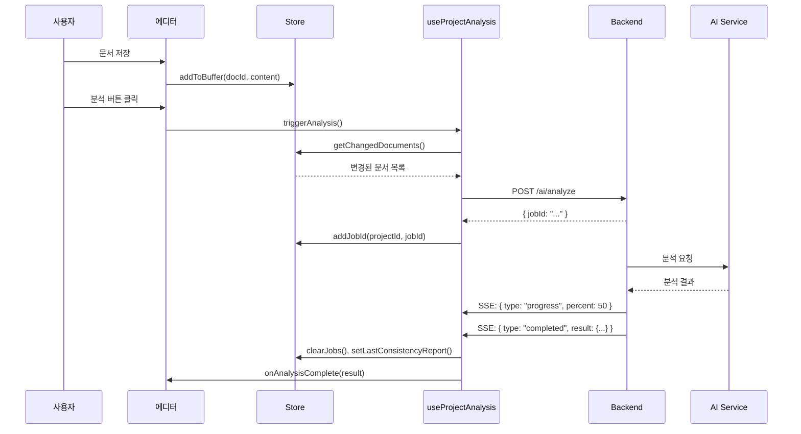
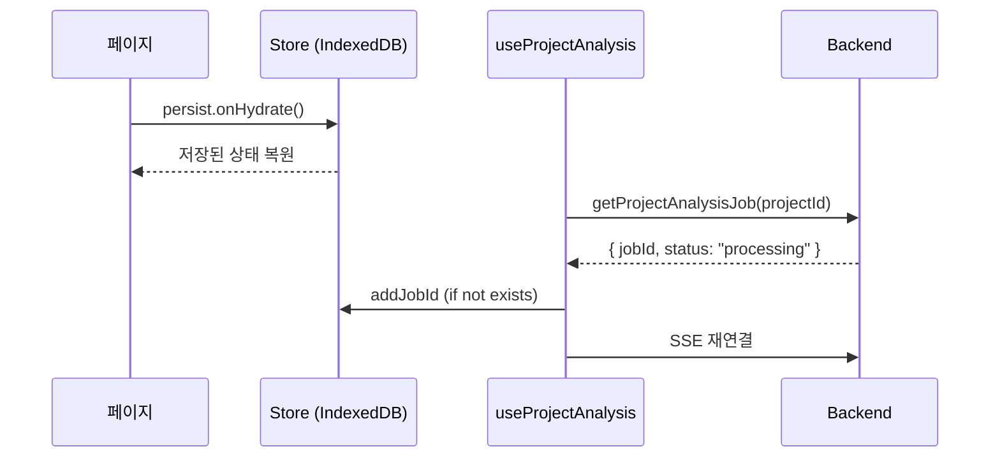

# StoLink AI 분석 시스템 기술 문서

> 이 문서는 StoLink 프로젝트의 AI 기반 스토리 분석 시스템의 설계, 구현, 테스트에 대한 종합 가이드입니다.

---

## 📋 목차

1. [시스템 개요](#시스템-개요)
2. [아키텍처](#아키텍처)
3. [핵심 컴포넌트](#핵심-컴포넌트)
4. [데이터 흐름](#데이터-흐름)
5. [주요 설계 결정](#주요-설계-결정)
6. [테스트 전략](#테스트-전략)
7. [트러블슈팅](#트러블슈팅)

---

## 시스템 개요

### 목적

사용자가 작성한 스토리 문서를 AI로 분석하여:

- **캐릭터 추출**: 이름, 성격, 외모, 관계
- **관계 분석**: 캐릭터 간 관계도 자동 생성
- **일관성 검사**: 설정 충돌, 타임라인 오류 탐지
- **복선 추적**: 심어진 복선과 회수 상태 관리

### 기술 스택

| 레이어    | 기술                      | 역할                                   |
| --------- | ------------------------- | -------------------------------------- |
| 상태 관리 | Zustand + immer + persist | 분석 버퍼, Job 상태, IndexedDB 저장    |
| 서버 통신 | TanStack Query + SSE      | 비동기 분석 결과 폴링 및 실시간 스트림 |
| 백엔드    | Spring Boot + FastAPI     | 분석 Job 관리, AI 모델 호출            |
| AI        | OpenAI GPT-4 / Claude     | 스토리 분석, 캐릭터 추출               |

---

## 아키텍처



---

## 핵심 컴포넌트

### 1. useAnalysisBufferStore (576줄)

**역할**: 전역 분석 상태 관리의 중심

**파일**: [useAnalysisBufferStore.ts](file:///Users/dongha/jungle/sto-link/src/stores/useAnalysisBufferStore.ts)

```typescript
// 핵심 상태
interface AnalysisBufferStore {
  buffer: BufferChunk[]; // 버퍼링된 문서
  bufferCharCount: number; // 총 글자 수
  activeJobs: Record<string, string[]>; // 모든 작업
  activeAnalysisJobs: Record<string, string[]>; // 분석만
  lastAnalyzedHashes: Record<string, string>; // 중복 방지용 해시
  pendingDocuments: Record<string, string>; // 분석 중 문서
  lastConsistencyReport: ConsistencyReport; // 마지막 분석 결과
}
```

**주요 패턴**:

| 패턴      | 설명                                                 |
| --------- | ---------------------------------------------------- |
| 버퍼링    | 문서 저장마다 누적, 임계치 도달 시 분석              |
| 해시 비교 | 같은 내용 재분석 방지                                |
| Job 분리  | `activeJobs` (전체) vs `activeAnalysisJobs` (분석만) |
| 미들웨어  | persist(IndexedDB) + immer(불변성)                   |

---

### 2. useProjectAnalysis (1040줄)

**역할**: 분석 요청/응답의 비즈니스 로직

**파일**: [useProjectAnalysis.ts](file:///Users/dongha/jungle/sto-link/src/hooks/useProjectAnalysis.ts)

```typescript
interface UseProjectAnalysisReturn {
  isAnalyzing: boolean; // 분석 중 여부
  analysisProgress: number; // 0-100 진행률
  triggerAnalysis: () => Promise<void>; // 분석 시작
  lastConsistencyReport: ConsistencyReport | null;
  isCheckingJobStatus: boolean; // 새로고침 후 복원 중
}
```

**핵심 흐름**:

1. **triggerAnalysis**: 변경된 문서만 추출 → API 요청
2. **SSE 구독**: 진행률 실시간 수신
3. **finalizeAnalysis**: 완료 시 캐시 무효화 + 콜백

---

### 3. useJobSSE (293줄)

**역할**: Server-Sent Events 연결 관리

**파일**: [useJobSSE.ts](file:///Users/dongha/jungle/sto-link/src/hooks/useJobSSE.ts)

```typescript
interface UseJobSSEOptions<T> {
  enabled?: boolean;
  onMessage?: (data: unknown) => void;
  onComplete?: (result: T) => void;
  onError?: (error: string) => void;
  terminateOnComplete?: boolean;
}
```

**이벤트 타입**:

| 이벤트      | 설명            |
| ----------- | --------------- |
| `progress`  | 진행률 업데이트 |
| `completed` | 분석 완료       |
| `failed`    | 분석 실패       |

---

### 4. aiService (199줄)

**역할**: AI API 호출 래퍼

**파일**: [aiService.ts](file:///Users/dongha/jungle/sto-link/src/services/aiService.ts)

```typescript
const aiService = {
  analyzeStory(payload),        // 분석 시작 (Job 반환)
  getJobStatus(jobId),          // Job 상태 조회
  getProjectAnalysisJob(projectId), // 프로젝트 최신 Job
  getConsistencyReport(projectId),  // 일관성 보고서
  getJobStreamUrl(jobId),       // SSE URL
}
```

---

### 5. 타입 정의 (analysisResult.ts)

**파일**: [analysisResult.ts](file:///Users/dongha/jungle/sto-link/src/types/analysisResult.ts)

**변환 흐름**:

```
Backend (snake_case) → Transform Functions → Frontend (camelCase)
```

```typescript
// 백엔드 응답
interface BackendConflict {
  severity?: "critical" | "HIGH" | "MEDIUM";
  document_id?: string; // snake_case
}

// 프론트엔드 사용
interface Conflict {
  id: string; // 생성된 고유 ID
  severity: "critical" | "warning";
  documentId?: string; // camelCase
}
```

---

## 데이터 흐름

### 분석 요청 흐름



### 새로고침 복원 흐름



---

## 주요 설계 결정

### 1. 왜 activeJobs와 activeAnalysisJobs를 분리했나?

| 상황        | activeJobs | activeAnalysisJobs |
| ----------- | ---------- | ------------------ |
| 분석 작업   | ✅         | ✅                 |
| 이미지 생성 | ✅         | ❌                 |
| SSE 구독    | -          | ✅ 이것만 사용     |

**이유**: 이미지 생성은 SSE 구독 불필요, 분석만 실시간 추적

---

### 2. 왜 콘텐츠 해시를 저장하나?

```typescript
lastAnalyzedHashes: { "doc-123": "hash-abc" }
```

**문제**: 사용자가 자주 저장 → 동일 내용 재분석 비용

**해결**: 해시 비교로 실제 변경 여부 확인

```typescript
getChangedDocuments(): BufferChunk[] {
  return buffer.filter(chunk => {
    const hash = calculateContentHash(chunk.content);
    return lastAnalyzedHashes[chunk.documentId] !== hash;
  });
}
```

---

### 3. 왜 IndexedDB를 사용하나?

| 저장소       | 용량   | 새로고침 후 | 탭 간 공유 |
| ------------ | ------ | ----------- | ---------- |
| localStorage | 5MB    | ✅          | ✅         |
| IndexedDB    | 수백MB | ✅          | ✅         |
| Memory       | ∞      | ❌          | ❌         |

**선택 이유**:

- 버퍼 크기가 5MB 초과 가능
- 새로고침 후 분석 상태 복원 필요

---

### 4. Stuck Detection (100% 도달 후 미완료 처리)

```typescript
// 100% 도달 후 3초가 지나도 완료 SSE가 안 오면 강제 완료
if (progress >= 100 && isAnalyzing) {
  setTimeout(() => finalizeAnalysis(), 3000);
}
```

**이유**: SSE 연결 끊김 또는 백엔드 완료 이벤트 누락 대응

---

## 테스트 전략

### 테스트 파일 구조

```
src/stores/
├── useAnalysisBufferStore.test.ts  (42개)
├── useAuthStore.test.ts            (9개)
├── useUIStore.test.ts              (18개)
├── useNotificationStore.test.ts    (11개)
├── useEditorStore.test.ts          (29개)
└── ...
```

**총 171개 테스트 통과**

### useAnalysisBufferStore 테스트 범위

| 영역          | 테스트 수 | 설명                      |
| ------------- | --------- | ------------------------- |
| 버퍼 관리     | 12        | add, remove, flush, clear |
| 프로젝트 변경 | 4         | 상태 초기화/유지          |
| Job 관리      | 8         | add, remove, clear        |
| 해시 비교     | 4         | 중복 분석 방지            |
| Conflict 상태 | 4         | resolved/ignored/deleted  |
| 분석 결과     | 4         | pending, snapshot         |
| 통합 시나리오 | 1         | 전체 흐름                 |

### 테스트 패턴

```typescript
beforeEach(() => {
  // 전체 상태 명시적 초기화
  useAnalysisBufferStore.setState({
    projectId: null,
    buffer: [],
    activeJobs: {},
    // ...
  });
});

it("변경된 문서만 추출", () => {
  // 해시 설정
  useAnalysisBufferStore.setState({
    lastAnalyzedHashes: { "doc-1": "hash-4" },
  });

  // 같은 내용 추가 (변경 없음)
  store.addToBuffer("doc-1", "Test"); // hash-4

  // 새 문서 추가 (변경됨)
  store.addToBuffer("doc-2", "New");

  const changed = store.getChangedDocuments();
  expect(changed).toHaveLength(1);
  expect(changed[0].documentId).toBe("doc-2");
});
```

---

## 트러블슈팅

### 1. 새로고침 후 진행률이 0으로 리셋

**원인**: Hydration 전에 SSE 연결 시도

**해결**:

```typescript
const isHydrated = useAnalysisBufferHydrated();

useJobSSE(projectId, getStreamUrl, {
  enabled: isHydrated && activeJobs.length > 0,
});
```

---

### 2. 동일 분석이 중복 실행

**원인**: 해시 비교 없이 모든 버퍼 전송

**해결**:

```typescript
const changedDocuments = store.getChangedDocuments();
if (changedDocuments.length === 0) return; // 변경 없으면 스킵
```

---

### 3. 100%에서 멈춤 (Stuck)

**원인**: SSE 완료 이벤트 누락

**해결**: 3초 타이머 후 강제 완료

```typescript
setTimeout(() => finalizeAnalysis(), 3000);
```

---

## 관련 파일 목록

| 파일                                                                                                                  | 줄 수 | 역할          |
| --------------------------------------------------------------------------------------------------------------------- | ----- | ------------- |
| [useAnalysisBufferStore.ts](file:///Users/dongha/jungle/sto-link/src/stores/useAnalysisBufferStore.ts)                | 576   | 전역 상태     |
| [useProjectAnalysis.ts](file:///Users/dongha/jungle/sto-link/src/hooks/useProjectAnalysis.ts)                         | 1040  | 비즈니스 로직 |
| [useJobSSE.ts](file:///Users/dongha/jungle/sto-link/src/hooks/useJobSSE.ts)                                           | 293   | SSE 연결      |
| [aiService.ts](file:///Users/dongha/jungle/sto-link/src/services/aiService.ts)                                        | 199   | API 래퍼      |
| [analysisResult.ts](file:///Users/dongha/jungle/sto-link/src/types/analysisResult.ts)                                 | 370   | 타입 + 변환   |
| [ProjectAnalysisListener.tsx](file:///Users/dongha/jungle/sto-link/src/components/common/ProjectAnalysisListener.tsx) | 45    | 완료 알림     |
| [GlobalAnalysisWatcher.tsx](file:///Users/dongha/jungle/sto-link/src/components/common/GlobalAnalysisWatcher.tsx)     | -     | 전역 감시     |

---

_문서 작성일: 2026-02-06_
