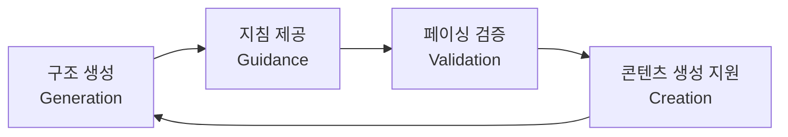

# 차세대 창작 지원 플랫폼 - 기능 요구사항 명세서

> 이 문서는 통합 저작 환경(Integrated Authoring Environment) 구축을 위한 기능적 사양을 정의합니다.

---

## 1. 핵심 개념: 통합 서사 개발 환경 (Narrative IDE)

차세대 글쓰기 서비스는 단순한 텍스트 에디터가 아닌, 작가의 **인지적 과정을 보조**하고 **서사 구조를 설계**하며 **데이터를 관리**하는 통합 환경입니다.

### 해결하려는 문제들

- 작가의 **인지적 부하(Cognitive Load)** 감소
- **창의적 몰입(Flow)** 극대화
- 복잡한 세계관/인물 관계/플롯의 체계적 관리

---

## 2. 창작 환경 최적화 기능

### 2.1 타자기 모드 (Typewriter Mode)

| 속성       | 설명                                           |
| ---------- | ---------------------------------------------- |
| **동작**   | 현재 입력 중인 라인을 화면 수직 중앙에 고정    |
| **스크롤** | 엔터 시 텍스트가 위로 올라감                   |
| **목적**   | 시선 고정으로 목 피로도 감소, 현재 문장에 집중 |
| **연동**   | 포커스 모드와 결합 시 주변 UI 제거             |

### 2.2 커스터마이징 (Customization)

```
필수 지원 항목:
├── 테마: 다크 모드, 라이트 모드, 세피아 모드
├── 텍스트 색상 커스텀
│   ├── 대사(Dialogue) 색상
│   └── 지문(Narration) 색상
├── 폰트 선택
│   └── 플랫폼별 프리뷰 (문피아, 조아라 스타일)
└── 키워드 강조
```

---

## 3. 구조적 사고의 시각화 - 삼위일체 구조

### 3.1 바인더 (Binder)

> 계층적 데이터베이스로서의 원고 네비게이션

**핵심 기능:**

- 폴더 자체가 텍스트 포함 가능
- 드래그 앤 드롭으로 챕터/씬 순서 변경
- 각 항목에 **라벨(Label)** 과 **상태(Status)** 부여
- 진행 상황 시각화 (초고, 수정 중, 완료)

### 3.2 코르크보드 (Corkboard)

> 공간적 서사 배치 - 정성적(Qualitative) 파악

**핵심 기능:**

- 각 문서를 시놉시스/메타데이터가 적힌 인덱스 카드로 변환
- 카드 드래그로 이야기 흐름 재배열
- 타임라인과 결합하여 인과관계/서브플롯 교차점 시각화

### 3.3 아웃라이너 (Outliner)

> 스프레드시트 형태 - 정량적(Quantitative) 통제

**표시 가능 메타데이터:**

| 필드         | 설명             |
| ------------ | ---------------- |
| 제목         | 씬/챕터 제목     |
| 시놉시스     | 요약             |
| 라벨/상태    | 태그 및 진행상태 |
| 목표 단어 수 | 설정된 목표      |
| 현재 단어 수 | 실제 작성량      |
| 시점(POV)    | 화자/관점        |
| 배경 장소    | 씬의 위치        |

---

## 4. 스플릿 뷰 메모창 (Split View Memory Window)

> **결론: 장편 서사 창작에서 선택이 아닌 필수적 인지 보조 장치**

### 4.1 필요성의 근거

**인지 심리학적 배경:**

- 작업 기억(Working Memory)은 7±2 청크로 제한됨
- 문맥 전환(Context Switching) 시 원래 몰입 상태로 돌아가는데 **최대 23분** 소요
- **참조적 연속성(Referential Continuity)** 제공으로 문맥 전환 비용 제거

### 4.2 구현 방식 비교

| 방식                                | 설명                  | 특징                              |
| ----------------------------------- | --------------------- | --------------------------------- |
| **인스펙터 (Inspector)**            | 화면 측면 고정 패널   | 문맥 감응형, 공간 효율적          |
| **멀티 페인 (Multi-Pane)**          | 에디터 수직/수평 분할 | 높은 자유도, 슬라이딩 페인        |
| **플로팅 윈도우 (Floating Window)** | 별도 창 분리          | 듀얼 모니터 최적화, Always on Top |

### 4.3 권장 구현

```
하이브리드 형태 = 인스펙터 + 멀티 페인
├── 인스펙터: 현재 씬 관련 정보 자동 표시
├── 멀티 페인: 사용자가 원하는 문서 동시 열기
└── 지능형 추천: 작성 중인 내용과 연관 정보 능동 추천
```

---

## 5. 작법 템플릿 (Writing Templates)

> **능동적 아키텍처(Active Architecture)로 구현**

### 5.1 4단계 구현 루프



### 5.2 지원해야 할 작법 이론

| 작법                           | 설명               |
| ------------------------------ | ------------------ |
| 영웅의 여정 (Hero's Journey)   | 12단계 신화적 구조 |
| 세이브 더 캣 (Save the Cat)    | 15개 비트 구조     |
| 눈송이 기법 (Snowflake Method) | 점진적 확장 방식   |
| 3막 구조                       | 설정-대립-해결     |

### 5.3 구체적 구현 사항

**a) 구조적 강제와 가이드**

- 템플릿 선택 시 비트(Beat) 기반 폴더/문서 자동 생성
- 예: "세이브 더 캣" → 오프닝 이미지, 주제 명시, 설정, 기폭제... 씬 카드 생성

**b) 인스트럭션 메타데이터**

- 각 비트에 작성 지침 내장
- 예: 기폭제 카드 → "주인공의 일상을 뒤흔드는 사건은 무엇인가?"

**c) 페이싱 시각화**

- 각 비트의 위치를 전체 분량 퍼센트로 매핑
- 이상적 위치 벗어날 시 시각적 경고

**d) 단계적 위자드 시스템**

1. 로그라인 작성
2. 캐릭터 욕망/결핍 설정
3. 주요 사건 배치
4. 이전 단계 입력값 자동 연동

---

## 6. 데이터 연동 UI (Data Interlocking UI)

> **LitRPG/게임 판타지/하드 판타지를 위한 핵심 기능**

### 6.1 스토리 바이블 (Story Bible)

**관리 대상 엔티티:**

```
스토리 바이블
├── 캐릭터 (Characters)
│   ├── 기본 정보 (이름, 외모, 성격)
│   ├── 스탯 (힘, 민첩, 지능...)
│   └── 관계도
├── 장소 (Locations)
├── 아이템 (Items)
├── 마법 체계 (Magic System)
├── 종족 (Species/Races)
└── 사건 (Events)
```

### 6.2 UI 구현 요소

| 기능                        | 설명                                                 |
| --------------------------- | ---------------------------------------------------- |
| **호버 카드 (Hover Cards)** | 키워드에 마우스 오버 시 엔티티 요약 팝업             |
| **멘션 (@)**                | @주인공 입력 시 자동완성 및 정보 표시                |
| **인라인 변수**             | `VIEW[{strength} * 2 + {weapon_damage}]` → 자동 계산 |
| **상태창 UI 모듈**          | 사이드바 슬라이더/입력 필드로 스탯 관리              |
| **시스템 메시지 블록**      | "시스템: 레벨업!" → 파란색 박스 자동 서식            |

### 6.3 동적 변수 구현

```yaml
# 메타데이터 예시 (YAML Frontmatter)
character:
  name: 주인공
  strength: 15
  weapon_damage: 10
  level: 5

# 본문 내 수식
총 공격력: VIEW[{strength} * 2 + {weapon_damage}] # → 40 렌더링
```

**수치 변경 시 자동 업데이트:**

- strength: 15 → 16 변경
- 모든 연관 수치 자동 재계산 (40 → 42)

### 6.4 데이터 수정 인터랙션

```
수정 방식:
├── 인라인 입력 필드: HP: [ 100 ] - 클릭하여 즉시 편집
├── 컨텍스트 메뉴: 우클릭 → "경험치 부여", "아이템 획득"
└── 변경 로그: 모든 수정 이력 자동 기록
```

---

## 7. 스크리브닝 (Scrivenings)

> **파편화된 문서들의 논리적 연속성 제공**

**핵심 기능:**

- 선택한 여러 문서를 임시로 이어붙여 하나처럼 표시
- 물리적 파일 병합 없이 편집 가능
- 장면 간 연결 다듬기
- 키워드 분포 확인

---

## 8. 스냅샷 (Snapshot)

> **창작의 심리적 안전망**

| 기능            | 설명                                     |
| --------------- | ---------------------------------------- |
| 시점 저장       | 특정 시점의 문서 상태를 "사진 찍듯" 저장 |
| 비교 (Diff)     | 현재 원고와 과거 스냅샷을 듀얼 뷰로 비교 |
| 복구 (Rollback) | 삭제했던 문단을 버튼 하나로 복구         |

**심리적 효과:** "망치면 어떡하지?" 두려움 제거 → 과감한 수정 시도 가능

---

## 9. 실시간 협업 (Real-time Collaboration)

**필수 기능:**

- 동시 텍스트 수정
- 실시간 코멘트
- 버전 충돌 없는 동기화 (CRDT 등)
- 베타 리더/편집자 피드백 시스템

---

## 10. 스토리 엘리먼트 (Story Elements)

- 모든 고유명사(인물, 지명, 사건)를 **객체화**하여 관리
- 드래그 앤 드롭으로 챕터에 할당
- 본문 내 자동 완성 호출

---

## 11. 게이미피케이션 (Gamification)

### 구현 요소

| 요소            | 설명                                               |
| --------------- | -------------------------------------------------- |
| **히트맵**      | 날짜별 집필량을 색상 농도로 시각화 (GitHub 스타일) |
| **스트릭**      | 연속 집필 일수 카운트, 손실 회피 심리 활용         |
| **목표 관리**   | 일일/주간/프로젝트 단어 수 목표 설정               |
| **배지**        | 목표 달성 시 디지털 배지 부여                      |
| **통계 시각화** | 생산성 패턴 분석 대시보드                          |

---

## 12. 플랫폼 프리셋 (Platform Presets)

### 지원 플랫폼별 설정

| 플랫폼                | 포맷 요구사항                               |
| --------------------- | ------------------------------------------- |
| **문피아/조아라**     | HWP, 줄간격 160-200%, 신명조                |
| **Amazon KDP**        | ePub, 특정 마진/들여쓰기                    |
| **표준 원고 (Shunn)** | 12pt Times New Roman, 이중 간격, 1인치 마진 |

### 내보내기 엔진 기능

- 원본 텍스트 미변경
- 클릭 한 번으로 변환
- 마진, 들여쓰기, 폰트, 챕터 제목 서식 자동 적용

---

## 13. 기능 우선순위 매트릭스

| 우선순위      | 기능                         | 근거           |
| ------------- | ---------------------------- | -------------- |
| **P0 (필수)** | 바인더, 에디터, 스플릿 뷰    | 기본 창작 환경 |
| **P0 (필수)** | 스크리브닝, 스냅샷           | 편집 필수 기능 |
| **P1 (높음)** | 스토리 엘리먼트, 데이터 연동 | 장르 차별화    |
| **P1 (높음)** | 작법 템플릿                  | 사용자 가치    |
| **P2 (중간)** | 코르크보드, 아웃라이너       | 고급 시각화    |
| **P2 (중간)** | 게이미피케이션               | 리텐션         |
| **P3 (낮음)** | 실시간 협업                  | 인프라 복잡성  |
| **P3 (낮음)** | 플랫폼 프리셋                | 추후 확장      |

---

## 부록: 참조 서비스

| 서비스        | 강점                                   |
| ------------- | -------------------------------------- |
| Scrivener     | 바인더, 코르크보드, 스크리브닝, 스냅샷 |
| Dabble        | 타자기 모드, 협업                      |
| Plottr        | 타임라인, 템플릿                       |
| Novel Factory | 단계별 위자드                          |
| Campfire      | 스토리 바이블, 세계관                  |
| Obsidian      | 플러그인 생태계, 인라인 변수           |
| World Anvil   | 세계관 데이터베이스                    |
| LivingWriter  | 스토리 엘리먼트, 협업                  |
