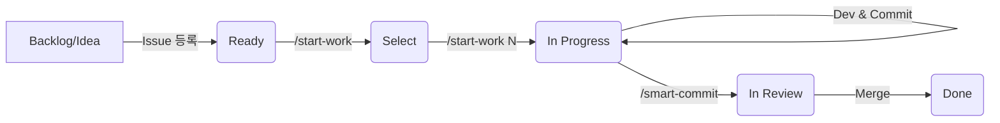

# 📘 STO-Link Development Standard Workflow

이 문서는 이슈 등록부터 작업 완료(Done)까지의 표준 개발 절차(**Best Practice**)를 정의합니다.

---

## 🏁 팀원 초기 설정 (Prerequisites)

이 워크플로우를 사용하기 위해 모든 팀원은 아래 설정이 필요합니다.

1.  **GitHub CLI 설치**: `brew install gh`
2.  **권한 설정 (필수)**:
    프로젝트 보드 자동화를 위해 `project` 권한이 필요합니다.

    ```bash
    gh auth login
    gh auth refresh -s project
    ```

    - 로그인 시 "GitHub.com" / "HTTPS" 선택 / "Login with browser" 권장.

---

## 🔁 전체 흐름 (Abstracted View)



1.  **Issue 등록** (`Ready`): 작업할 내용을 정의하고 우선순위를 정해 보드에 올립니다.
2.  **작업 시작 (Pull)** (`In Progress`): 개발자가 `Ready` 상태의 작업을 **스스로 가져와** 시작합니다.
3.  **구현 및 커밋**: 로컬에서 코드를 작성하고 커밋합니다.
4.  **PR 생성** (`In Review`): 작업 내용을 리뷰 요청합니다.
5.  **완료** (`Done`): 승인 후 병합되면 작업이 종료됩니다.

---

## 🛠️ 단계별 상세 가이드

### Phase 1. Issue 등록 (Manager / Planner / Developer)

> **목표:** '무엇을 할지' 명확히 정의하여 `Ready` 상태로 만듭니다.

1.  **이슈 생성**: `stolink-manage` 레포지토리에서 New Issue 작성.
2.  **프로젝트 추가**: 우측 사이드바 `Projects`에서 **`stolink board`** 선택.
3.  **Status 설정**: 'Status'를 **`Ready`**로 설정.
    - (Option) 중요도, 사이즈 등을 입력.
    - **⭐️ 중요: 이슈 제목은 "그래프 UI 개선"처럼 명확하고 간결한 '기능 단위'로 작성**해주세요. (브랜치 이름 생성 기준이 됩니다.)
    - _(참고)_ Draft Item으로 보드에서 먼저 만들고 나중에 'Convert to Issue' 해도 됩니다.

### Phase 2. 작업 가져오기 (Developer)

> **목표:** `Ready` 작업을 선택하고, 브랜치 생성 및 담당자 할당, 상태 변경을 **자동화**합니다.

1.  **목록 조회 또는 작업 시작**:

    ```bash
    /start-work          # 작업 가능한 이슈 목록 보기
    /start-work <이슈번호>  # 바로 작업 시작
    ```

    - 예: `/start-work 3`

2.  **자동 수행되는 일**:
    - AI Agent가 이슈 내용을 파악하여 **적절하고 간결한 영문 브랜치명**을 생성합니다.
      - 예: 이슈 "그래프 UI 개선" -> 브랜치 `feature/123-graph-ui`
    - 브랜치 생성 및 이동.
    - 담당자(Assignees)에 **나(`@me`)** 할당 (백그라운드).
    - 프로젝트 상태 변경: `Ready` → **`In Progress`** (백그라운드).
3.  작업 시작!

### Phase 3. 구현 및 커밋 (Developer)

> **목표:** 안전하게 코드를 작성하고 저장합니다.

1.  코드 작성 및 테스트.
2.  커밋 (중간 저장):

    ```bash
    git add .
    git commit -m "feat: 로그인 API 연동"
    ```

    - _Tip:_ 일반적인 `git` 명령어를 자유롭게 사용하세요.

### Phase 4. 리뷰 요청 및 완료 (Developer)

> **목표:** PR을 생성하고 Issue와 연결합니다.

1.  작업 완료 후 실행:
    ```bash
    /smart-commit
    ```
2.  **자동 수행되는 일**:
    - Lint / Type Check 검증.
    - 이슈 자동 연결 (`Closes stolink/stolink-manage#123`).
    - Pull Request 생성.
3.  **PR 상태**: PR이 생성되면 프로젝트 보드에서 자동으로 추적됩니다. (`In Review` 등의 자동화 설정 필요 시 GitHub Project 설정에서 가능)

### Phase 5. Merge & Done

1.  GitHub 웹에서 PR **Squash and Merge**.
2.  **자동 완료**:
    - PR이 머지되면 연결된 Issue가 `Closed` 됩니다.
    - GitHub Project의 'Auto-archive' 또는 Workflow 설정에 따라 카드가 **`Done`**으로 이동합니다.

---

## ❓ 자주 묻는 질문 (FAQ)

**Q. 할당되지 않은 이슈도 가져올 수 있나요?**
A. 네! `/start-work`는 `Ready`, `Open` 상태인 모든 이슈를 보여주므로, 할당되지 않은 것을 선택하면 자동으로 본인을 할당하고 가져옵니다. (Pull 방식)

**Q. 이슈 없이 작업을 시작해버렸다면?**
A. `/smart-commit`을 할 때 브랜치 이름에 번호가 없으면 **자동으로 이슈를 생성**해주므로 걱정 마세요. (다만, Phase 1~2를 따르는 것이 관리에 더 좋습니다.)
